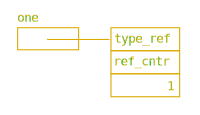

# Dzieja Concept             <!-- omit in toc -->

## Contents                  <!-- omit in toc -->

- [1. Introduction](#1-introduction)
- [2. Types and Declarations](#2-types-and-declarations)
  - [2.1. Fundamental Types Review](#21-fundamental-types-review)
  - [2.2. Variables](#22-variables)
    - [2.2.1. Variable Declarations](#221-variable-declarations)
    - [2.2.2. Name Scopes](#222-name-scopes)
    - [2.2.3. RAII Logic with Name Scopes and `nest` Variables](#223-raii-logic-with-name-scopes-and-nest-variables)
  - [2.3. The `null` Object](#23-the-null-object)
  - [2.4. Boolean Type](#24-boolean-type)
  - [2.5. Numeral Types](#25-numeral-types)
  - [2.6. String and Character Types](#26-string-and-character-types)
  - [2.7. Collections](#27-collections)
    - [2.7.1. Array](#271-array)
    - [2.7.2. Tuple](#272-tuple)
    - [2.7.3. Dictionary](#273-dictionary)
    - [2.7.4. Set](#274-set)
- [3. Methods](#3-methods)
  - [3.1. Methods Declaration](#31-methods-declaration)
  - [3.2. Parameters and Return Type](#32-parameters-and-return-type)
  - [3.3. Lambdas](#33-lambdas)
- [4. Custom Types](#4-custom-types)
  - [4.1. Type Declaration](#41-type-declaration)
    - [4.1.1. Instance Direct Initialization](#411-instance-direct-initialization)
    - [4.1.2. Default Initialization Values](#412-default-initialization-values)
    - [4.1.3. Methods for Custom Types](#413-methods-for-custom-types)
  - [4.2. Type Encapsulation](#42-type-encapsulation)
    - [4.2.1. Access Control](#421-access-control)
    - [4.2.2. Type Implementation](#422-type-implementation)
    - [4.2.3. Constructor and Destructor](#423-constructor-and-destructor)
  - [4.3. Solid Types](#43-solid-types)
    - [4.3.1. Solid Type Declaration](#431-solid-type-declaration)
    - [4.3.2. Built-in Solid Types](#432-built-in-solid-types)
    - [4.3.3. Solid Arrays](#433-solid-arrays)
- [5. Namespaces](#5-namespaces)
- [6. Statements](#6-statements)
  - [6.1. `if`-Statement](#61-if-statement)
  - [6.2. `goto`-Statement](#62-goto-statement)
- [7. Expressions](#7-expressions)
- [8. Operators](#8-operators)
  - [8.1. Ternary Operator](#81-ternary-operator)
- [9. Implementation Thoughts](#9-implementation-thoughts)
  - [9.1. Calling Convention](#91-calling-convention)
  - [9.2. Access to the Type Members](#92-access-to-the-type-members)
- [10. Problems](#10-problems)
- [11. References](#11-references)

## 1. Introduction

A motivation to create another programming language was my dissatisfaction of
Python. The Julia language looked like a solution, but it was wrong feeling.
Julia has awful module system, that is useless for any big project. Another
issue of Julia is slow compiling time. Theoretically it is resolved with
caching, but it's not. I think Julia saves [IR][wiki-IR]-code in cache, but
IR-code is some high level code that is not optimized soundly. It leads to long
compiling time for before script starting. For instance, when I import ArgParse
library to a script, the run becomes longer for 3 seconds!

Of course, I don't believe that I can write own programming language from
scratch. So I look at the project like at _just for fun_ project, that can gives
me some experience in compiler technologies.

The basis of the Dzieja syntax is the C/C++ syntax, because I don't want to
reinvent the wheel.

## 2. Types and Declarations

Dzieja's type system has treelike structure. The `any` type resides in the root.
The others types inherit from `any`.

### 2.1. Fundamental Types Review

Dzieja has a set of _fundamental types_ corresponding to the most common storage
units:

1. A Boolean type (`bool`)
2. Character type (`char`)
3. String type (`string`)
4. Integer types (`int`, `uint`)
5. Floating-point types (`float`, `double`)
6. Tuple type
7. Array type
8. Dictionary type
9. Set type

If to imagine a scheme showing the type system we well see the following
picture:

- `any`
  - `bool`
  - `number`
    - `integer`
      - `i8`, `i16`, `i32`, `i64`, `i128`
      - `u8`, `u16`, `u32`, `u64`, `u128`
      - `(u)int` (platform dependent)
    - `basefloat`
      - `float`/`f32`
      - `double`/`f64`
      - `long double`/`f80` (_Is it needed? It is in C/C++ only._)
  - `basechar`
    - `char`
  - `basestring`
    - `string`
  - `tuple`
  - `array`/`sarray`
  - `list` (_Must it be built-in?_)
  - `dict`
  - `set`

### 2.2. Variables

Before more detailed description of standard types we will pass through basis of
variables usage. It helps to understand posterior material.

#### 2.2.1. Variable Declarations

Each variable is a name that is bound with corresponding value and is usually
just a reference to the value-object. When we reassign the variable to a new
value, the variable just takes the address of another object, and original
object remains without changes. One thing that is changed, reference counters of
these objects are incremented by 1 (for new value) and decremented by 1 (for old
value). More details you see in the Memory Control chapter.

> **TODO**: Add reference to Memory Control description

In order to declare a variable of `any` type write:

```dzieja
any one = 1;
any s = "hello", t = "bye";
```



> **QUESTION**: is implicit variable initialization needed?

Variable declaration consists of a type, and variable declarator list. Each
declarator is variable name with initial value separated by `,`.

Each variable has a bound type, and can assign an object of either that type or
derived. Obviously, `any` variable can be assigned to any object, since every
type inherits it.

```dzieja
Number n = 1;         # OK. `int` is subtype of `Number`
n = 1.0;              # OK. `float` is subtype of `Number` too
n = "hello";          # WRONG. `string` is not subtype of `Number`
```

#### 2.2.2. Name Scopes

In my opinion absence of nested name scopes in many dynamic languages is a big
disadvantage. Nested name scopes give a capability to create a small life time
variables, what let a programmer cut down amount of variables to think about at
the same time.

So general rules of name scope system are:

1. A name declared in outer name scope is visible in inner.
2. If a new inner name is the same as already existent external, the inner name
   overlays the outer.
3. A name declared in a concrete name scope is inaccessible outside.

The highest name scope is _global_ name scope. Each compound statement `{}`
creates own name scope.

Name scope of a function starts with function parameters and includes the
function compound statement. The same situation with `for`, `while`, `if`
statements: their name scope includes condition and statement body.

#### 2.2.3. RAII Logic with Name Scopes and `nest` Variables

Also nested name scope system allows to use [RAII][wiki-RAII] objects much more
flexibly, and you don't need to use special language constructions like Python's
`with`. So let's view Dzieja's abilities from that point of view.

Since Dzieja uses reference counters for memory management, she guarantees that
after object reference counter reaches zero, the object will be destroyed. But
that cannot guarantees that the reference counter will be zero in the end of the
name scope.

```dzieja
{
    any f = File("filename");
    foo(f);
}
# the file object can still exist
```

To guarantee destroying at the end of scope, you ought to use `nest` keyword:

```dzieja
{
    nest any f = File("filename");
}
# file object is destroyed
```

_Nested_ objects are checked at the name scope end for reference counter value.
If the value doesn't equal zero, the language throws an exception `NestedError`.
Even so the object will be destroyed. That done in order to keep a programmer
from ignoring the exception and continue work of the code. It would deprive
`nest` mechanism of sense.

### 2.3. The `null` Object

The `null` is special object of special type `null_t`. `null_t` doesn't derive
from `any` type, i.e. it is not a part of the type tree. `null` is single object
of `null_t`. You cannot create another one, and you cannot declare a variable of
the `null_t` type. Why is this object needed? Usually it's used like invalid
value. But using of `null` object is very error prone. So by default Dzieja
forbids to assign this object to a variable:

```dzieja
any a = null;       # ERROR
```

When a programmer declares a variable, the compiler thinks that this variable
cannot be equal to `null`. It is done in order to escape very regular error of
`null`-pointer dereference. But sometimes we need to check for _invalid_ value.
And `null` is indeed right for that. But we want to the compiler helps us not to
forget check for `null` value. Let's look at the example below:

```dzieja
any a = 4;
any b = a + 3;      # OK. `a` cannot have `null` value
a = null;           # ERROR

any? c = 4;
any d = c + 3;      # ERROR. c must be check for `null`

any e = (c is null ? 0 : c) + 4;    # OK

if (c is null)
    throw Error{};
any f = c;          # OK
```

The `?` qualificator is used to allow a variable to have `null` value. But this
makes the compiler to throw error if the programmer hasn't checked a nulled
variable for `null`.

At first sight this feature looks strange in dynamic type language because an
error can be caused not only `null` variable value, also the variable can have
another type that is not compatible with expression where the variable is used.
But my Python practice says that exactly absence of `null` check leads to error
most often. Furthermore, additional Dzieja's type restrictions makes the `null`
check still more sensible.

Certainly Dzieja cannot check every wrong usage of `null` object due to its
dynamic nature, but I hope it helps to minimize so typical bugs.

### 2.4. Boolean Type

Boolean type `bool` has two literal values: `true` and `false`.

List of logical operators:

| Operator    | Type   | Description   |
| ----------- | ------ | ------------- |
| `!`,  `not` | Unary  | Logical _not_ |
| `&&`, `and` | Binary | Logical _and_ |
| `||`, `or`  | Binary | Logical _or_  |

### 2.5. Numeral Types

### 2.6. String and Character Types

A string literal is concluded within double quotes, whereas character literal —
within single quotes:

```dzieja
string s = "hello";
char c = 'A';
```

Some string literals divided with space characters of empty space are
interpreted as one string literal:

```dzieja
string s = "hello"", " "world!\n";      # is one string "hello, world!\n"
```

Escape sequences:

| Escape Sequence | Meaning                          |
| --------------- | -------------------------------- |
| `\\`            | Backslash (`\`)                  |
| `\'`            | Single quote (`'`)               |
| `\"`            | Double quote (`"`)               |
| `\a`            | Bell                             |
| `\b`            | Backspace                        |
| `\f`            | Form feed                        |
| `\n`            | New line (LF)                    |
| `\r`            | Carriage return (CR)             |
| `\t`            | Horizontal tabulator             |
| `\v`            | Vertical tabulator               |
| `\ooo`          | Character with octal value _ooo_ |
| `\xhh`          | Character with hex value _hh_    |
| `\uxxxx`        | Character with 16-bit value      |
| `\Uxxxxxxxx`    | Character with 32-bit value      |

To prevent the frustration caused by multitude of escape characters, Dzieja
provides two kinds of _raw strings_. The first is python style string with
`r"`-`"` circumfix. That strings can contain any character without escaping,
except double quote `"` and backslash `\` at the end of string.

```dzieja
any s1 = r"tabulator - \t";             # OK
any s2 = r"backslash - \\";             # requires escaping at the end of string
any s3 = r"\" - double quote";          # `"` requires escaping too
```

The second raw string type is C++ string style with `R"xxx(`-`)xxx"` circumfix,
where `xxx` is optional character sequence:

```dzieja
string s = R"***(Raw string usually ends with )")***";
```

In the example above the string is _Raw string usually ends with )"_.

### 2.7. Collections

#### 2.7.1. Array

In order to declare an array object use square brackets:

```dzieja
any a = [1, 3, 5];
any b = ["hello", 1, 3.0];
```

The `array` is a template type: `array<item_t>`. In our example above the
`item_t` type is defined automatically. It is the nearest common type in type
[tree](#fundamental-types-review). So `a` has type `int`, `b` has type `any`.

What about multidimensional arrays? They are just arrays of arrays. For example,
take a look on the following code and memory map:

```dzieja
any a = [[1, 2], [3, 4]];
```


To get any element of the array use subscripting:

```dzieja
print(a[1]);            # -> [3, 4]
print(a[0][0]);         # -> 1
```

#### 2.7.2. Tuple

Contrary to `array`, `tuple` can contain items of any type, but quantity of the
items is immutable. To declare the `tuple` instance enumerate items through `,`
and optionally within `(`-`)`:

```dzeja
any a = "hello", true, 375;
any b = ("bye", false, 0);
```

Tuple object from the example has type `tuple<string, bool, int>`.

In order to address to `tuple` item use subscript syntax as for `array`s:

```dzieja
print(a[0]);        # -> hello
```

> **TODO**: Due to syntax with well-defined name scopes, and two kinds of
> arrays, it needs to discuss the best way of all type brackets usage.

```dzieja
(i64 a, string b, f64 c) = (1, "hello", 2);

(a, b, c) = 1, "hello", 2;
```

#### 2.7.3. Dictionary

#### 2.7.4. Set

## 3. Methods

Methods in Dzieja have some distinguishes from C++ function and methods. In
Dzieja we have _open multi-methods_ (look at
[here][art-open-multi-methods-for-c++] for reading of the proposition for C++
implementation). The methods differ both from C++-functions and C++ methods.

### 3.1. Methods Declaration

Dzieja has two ways of methods declaration. The first — _compound style_ — is
below:

```dzieja
sum(lhs, rhs) {
    return lhs + rhs;
}
```

The second — _math style_ — looks like this:

```dzieja
f(x, y) = x + y;
```

Difference between them is that classical style has function body with multiple
statements within, whereas math style has only one expression, which is the
return value as well.

### 3.2. Parameters and Return Type

In previous chapter we declared the method which gets two arguments and returns
value of sum these arguments. We didn't specify types of return value and
arguments, but they have. If you don't write parameter type it will be `any` by
default.

Absence of return type can be interpreted differently. If the function body has
`return` statement the return type will be the nearest common parent type of
objects in all return statements, if compiler can determine them. Otherwise,
when compiler has no idea what type each return object has, the return type will
be `any`. If the function body doesn't have any `return` statements it's
considered that function doesn't have return type (like `void` in C/C++).

Since we have `any` arguments we can assign arguments of any types, that support
`+` operator:

```dzieja
sum(3.0, 5.0);              # OK. Result is 8
sum("Hello ", "world");     # OK. Result is "Hello world"
```

Let's write another method with the same name, but other parameters types:

```dzieja
float sum(float a, float b, float c) {
    return a + b + c;
}
```

As you see now the method expects three arguments of float type. So we have to
launch it thus:

```dzieja
sum(1.0, 3.0, 5.0);         # OK. Result is 9.0
sum("a", "b", "c");         # ERROR! Proper method implementaion is not found.
```

When the programmer write some methods with the same name, Dzieja creates a
family of these methods. So if you run the method in your code, Dzieja's looking
for implementation with proper argument types. If proper implementation is
found Dzieja runs it, if isn't then Dzieja throws an exception.

Search of proper implementation proceeds in arguments order. The compiler takes
the first argument. If there is some methods with proper first parameter type
within all implementations, compiler passes to the second argument and search
the needed implementation within them, and so on.

Note that the compiler doesn't check for return value type, because usually it
cannot. Typically we will know return type only after the method running. So,
you cannot declare two methods with the same parameters types, but different
return type.

### 3.3. Lambdas

Lambda can have one expression form and multiple expression, like usual method.

```dzieja
any lambda = (x) -> x*x;                # one-expression form
lambda = int (int x) -> x*x;            # the same with explicit typing

any hypo = (a, b) {                     # multiple-expression lambda
    any c = a*a + b*b;
    return sqrt(c);
}

hypo = float (float a, float b) {       # the same with explicit types
    float c = a*a + b*b;
    return sqrt(c);
}
```

Since any lambda is anonymous function it has only one implementation. So
searching of proper method is not passed, only parameter types checking.

## 4. Custom Types

For custom type introducing we will write `Date` type (inspired by Bjarne
Stroustrup's [classic book][book-stroustrup-c++]).

### 4.1. Type Declaration

Custom types are declared with two keyword `type` and `struct`.

```dzieja
type Date struct {
    int y, m, d;
}
```

Above you can see a declaration of type `Date` with three `int` members. The
`type` keyword says to compiler that we create a new custom type. `struct` says
that it is description of data layout.

#### 4.1.1. Instance Direct Initialization

In order to create an instance of the `Date` write:

```dzieja
first_day = Point{2020, 1, 1};
last_day = Point{
    d = 31,
    m = 12,
    y = 2020
};
```

This is the easiest way to initialize any instance. You specify value of each
member in order members declarations within curly braces. Also you can
explicitly name each member to be sure in correct initialization not taking care
of members order.

#### 4.1.2. Default Initialization Values

If you didn't specify value for a member in direct initialization, it will be an
error.

```dzieja
day = Point{
    y = 2020,
    m = 11
};
```

If we don't want to write full list members with their initializers, we can set
default value of day. It can be made in `struct` declaration:

```dzieja
type Date struct {
    int y = 1;
    int m = 1;
    int d = 1;
}
```

After the declaration above the code `christs_birthday = Date{}` creates date
1-th January 1 A.D.

#### 4.1.3. Methods for Custom Types

Now let's add a method (why I don't call it _function_ you will see chapter
[Methods](#methods)) to add year:

```dzieja
void add_year(Date date, int years)
{
    date.y += years;
}
```

And run the method:

```dzieja
# now run the method either thus
add_year(first_day, 1);

# or thus
first_day.add_year(2);
```

We can call the method in function style and in method style. In Dzieja we don't
have classic division into functions and methods like in C++ for example. We use
_open multi-methods_ (more details in [Multiple Dispatch](#multiple-dispatch)
chapter and this [article][art-open-multi-methods-for-c++]).

### 4.2. Type Encapsulation

We will understand [encapsulation][wiki-encapsulation] as a way supporting type
[invariant][wiki-class-invariant]. It means that for a type must be given
methods which guarantee the type instance state correctness.

#### 4.2.1. Access Control

First of all we need to control access to member of class. It allows to protect
user from accidental changing inside of a instance that can lead to incorrect
state. For that use `priv` keyword:

```dzieja
type Date struct {
    priv int y;
    priv int m, d;
}
```

or, for simplicity, you can set `priv` mode on entire type:

```dzieja
type Date priv struct {      # now each member is private by default
    int y, m, d;
}
```

For access control Dzieja has two keywords `pub` and `priv`. By default all type
members are public. You can change default access control by adding `priv`
keyword before `struct` keyword in type declaration. Also you can change access
mode for each member using these keywords.

#### 4.2.2. Type Implementation

After last changing the `add_years` method does not work because it hasn't got
access to members of the Date instance. But we can define API for our class with
methods that will support type invariant.

```dzieja
type Date impl {
    void add_years(int years)
    {
        y += years;    # or this.y += years;
    }
}
```

Here we continue to define the `Date` type. Although `y`-member is private now,
we can address to it because we are in _implementation_ part of type definition.
In contrast to `struct` part which can be certainly one, the `impl` part can be
defined more than once.

_Structure_ part and _implementation_ part are divided. It's done for more
flexible ability to extend the type API by other programmers in other source
files.

Take note that method within `impl` section differs from standard method in its
arguments members access only. In other respects it is typical method.

#### 4.2.3. Constructor and Destructor

Constructor is special method that is run right away after memory allocation for
type instance. Unlike [direct initialization](#instance-direct-initialization)
syntax, constructor is used to establish type invariant. Look at constructor for
our `Date` type:

```dzieja
type Date impl {
    new(int year, int month, int day)
    {
        if (is_correct(year, month, day) {
            y = year;
            m = month;
            d = day;
        }
        // message of error
    }
}
```

To define constructor we use `new` keyword. It is no method name, and you cannot
run constructor with it. To run constructor use the following syntax:

```dzieja
date = Date(1999, 12, 1);
```

It looks just like method calling, but method name equals type name. And before
constructor calling memory allocation happens.

> **TODO**: it's needed to decide circumstances when direct initialization
> syntax is turning off.

Destructor is run when the instance is deleting by GC or in the end of name
scope if the instance is declared as `nest`.

```dzieja
type Date impl {
    del() {
        # free resources
    }
}
```

> **QUESTION**: is it needed syntax for explicit run of destructor?

In our case the `Date` type doesn't need destructor, so the example above is
redundant.

Whereas we can define many constructors, destructor can be only one.

> **QUESTION**: perhaps `constructor` and `destructor` keywords are better?

### 4.3. Solid Types

Assume we've declared the following type `Point`:

```dzieja
type Point struct {
    float x;
    float y;
}
```

Now let's create an instance of our type and see how the instance looks in
memory:

```dzieja
any home = Point{
    x: 0.0,
    y: 0.0
};
```


As you can see the instance reminds of a tree. Each member of our instance is a
pointer to data with reference counter and type reference. Of course it is not
efficient way of data storing, but it allows to control memory usage. Dzieja
provides more memory efficient way of data composition.

Dzieja divides types into two kinds: _loose_ and _solid_ types. As you've
guess in our example above `Point` is a loose type. Now let's try to rewrite
the code in order to make `Point` type a solid piece of memory:

```dzieja
type SolidPoint
solid struct {
    float x;
    float y;
}

home = SolidPoint{x: 0.0, y: 0.0};
```


We just added `solid` keyword and now it looks much more compact.

#### 4.3.1. Solid Type Declaration

In order to declare solid type you need add keyword `solid` before `struct`.
A solid type cannot includes members of loose type inside itself:

```dzieja
type Person solid struct {          # WRONG! You have to remove `solid` keyword
    string firstname;               # because `string` is solid type
    string lastname;
    int age;
}
```

On the contrary, loose type can have unlimited members of solid type, what
`Person` type proves, as it consists of both solid and loose types.

#### 4.3.2. Built-in Solid Types

There is the list of built-in solid types below:

1. Integer types, except basic types like `Number`, `Integer`, `BasicFloat`,
2. Boolean type `bool`,
3. `char` (not `BasicChar`!).

#### 4.3.3. Solid Arrays

In [Array](#array) chapter it was said, that `array` is a massive of pointers to
others object, i.e. it is a loose type. So by analogy with our `Point` and
`SolidPoint` types, Dzieja provides solid variant of `array` — `sarray`. As the
other solid types, `sarray` cannot store elements of loose types, and its items
cannot be assigned with derived type instances.

```dzieja
any arr = <1, 2, 3>;
```


The difficulty with array literals lies in ambiguity of loose and solid
versions. If Dzieja determine which type of array use dynamically, it can affect
code behavior without the programmer wish. So, now I think that solid array
literal should be declared explicitly:

```dzieja
any solid_array = <1, 2, 3>;
any solid_matrix = <<1, 2>, <3, 4>>;  # or
any solid_matrix = <1, 2; 3, 4>;
```

## 5. Namespaces

Dzieja's namespaces are very like C++ namespaces. It extends name in current
module and names of exported names from module. Consider an example:

```dzieja
namespace str {
    export
    split(string a) { return ""; }
}
```

## 6. Statements

### 6.1. `if`-Statement

### 6.2. `goto`-Statement

It would be nice to have `goto default` for `switch` statement.

## 7. Expressions

## 8. Operators

### 8.1. Ternary Operator

Ternary operator is an expression. That means the ternary operator returns a
value.

There are three variants of syntax:

1. C/C++ style — `<cond-expr> ? <then-expr> : <else-expr>`;
2. Python style — `<then-expr> if <cond-expr> else <else-expr>`;
3. Another style — `if <cond-expr> then <then-expr> else <else-expr>`.

I think a ternary operator with keywords `if`, `else` will be better than
classical `?:` because it is much more visible in a code.

## 9. Implementation Thoughts

### 9.1. Calling Convention

Calling convention is directly concerned with the multiple dispatch, since it
requires additional information about arguments.

### 9.2. Access to the Type Members

Dzieja can have corresponding _type object_ to each type. This object stores
hash table in which the key is a member name and the value is offset of the
member in type instance.

```cpp
struct SomeType {
    map<string, offset_t> member_table;
};
```

In order to address to member the compiler generates either `get`-call of
`member_table` for instance of statically unknown type or access with member
offset for instance of statically known type.

## 10. Problems

1. Expression problem.
2. `null` checking problem.
3. RAII objects.
4. First class function syntax.
5. Built-in debug mode? `debug` keyword?

## 11. References

1. Bruno C. d. S. Oliveira and William R. Cook. ["Extensibility for the Masses.
   Practical Extensibility with Object
   Algebras"][art-extensibility-for-the-masses].
2. Peter Pirkelbauer, Yuriy Solodkyy, Bjarne Stroustrup. ["Open Multi-Methods
   for C++"][art-open-multi-methods-for-c++].
3. Eli Bendersky. ["The Expression Problem and its
   solutions"][web-expression-problem-and-its-solutions].
4. Shriram Krishnamurthi, Matthias Felleisen, Daniel P. Friedman. ["Synthesizing
   Object-Oriented and Functional Design to Promote
   Re-Use"][art-synthesizing-oo-and-functional-design].
5. Jeffrey Bezanson. ["Abstraction in Technical
   Computing"][art-abstraction-in-technical-computing].
6. Chris Lattner's [blog][web-lattner].
7. Chris Lattner. [Random LLVM Notes][web-lattner-llvm-notes].
8. H. J. Lu, Michael Matz, Milind Girkar, Jan Hubička, Andreas Jaeger, Mark
   Mitchell. ["System V Application Binary Interface AMD64 Architecture
   Processor Supplement"][art-system-v-abi-amd64].
9. Chris Lattner, Mehdi Amini, Uday Bondhugula, etc. ["MLIR: A Compiler
   Infrastructure for the End of Moore's Law"][art-mlir].
10. Bjarne Stroustrup. ["The C++ Programming Language"][book-stroustrup-c++].

[art-abstraction-in-technical-computing]: https://github.com/JeffBezanson/phdthesis/blob/master/main.pdf
[art-extensibility-for-the-masses]: http://www.cs.utexas.edu/~wcook/Drafts/2012/ecoop2012.pdf
[art-mlir]: https://arxiv.org/abs/2002.11054
[art-open-multi-methods-for-c++]: http://www.stroustrup.com/multimethods.pdf
[art-synthesizing-oo-and-functional-design]: https://cs.brown.edu/~sk/Publications/Papers/Published/kff-synth-fp-oo/
[art-system-v-abi-amd64]: https://github.com/hjl-tools/x86-psABI/wiki/x86-64-psABI-1.0.pdf
[book-stroustrup-c++]: http://www.stroustrup.com/4th.html
[web-expression-problem-and-its-solutions]: https://eli.thegreenplace.net/2016/the-expression-problem-and-its-solutions/
[web-lattner]: http://nondot.org/sabre/
[web-lattner-llvm-notes]: http://nondot.org/sabre/LLVMNotes/

[wiki-class-invariant]: https://en.wikipedia.org/wiki/Class_invariant
[wiki-encapsulation]: https://en.wikipedia.org/wiki/Encapsulation_(computer_programming)
[wiki-IR]: https://en.wikipedia.org/wiki/Intermediate_representation
[wiki-RAII]: https://en.wikipedia.org/wiki/Resource_acquisition_is_initialization
